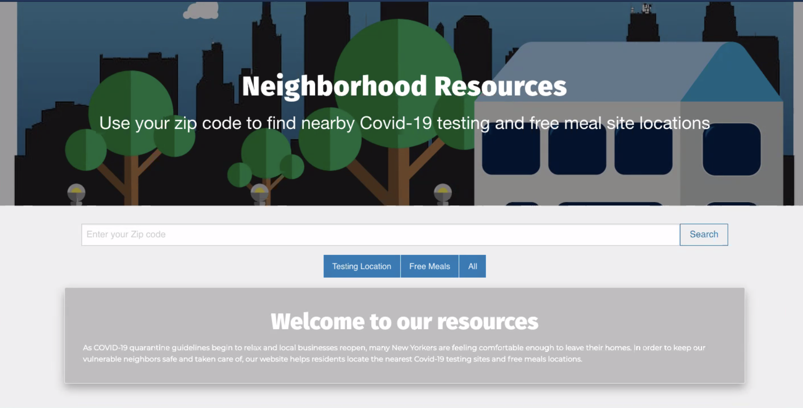

# COVID-19-Resource Project

A website that uses API routes to locate COVID19 Testing Centers and Free Meals Locations based on NYC ZIP Code.

## Table of Contents

- [Motivation](#Motivation)
- [Deployment](#Deployment)
- [Usage](#usage)
- [Technologies](#technologies)
- [Look](#look)
- [Contributors](#Contributors)

## Motivation

As COVID-19 quarantine guidelines begin to relax and local businesses reopen, many New Yorkers are feeling comfortable enough to leave their homes. In order to keep our vulnerable neighbors safe and taken care of, our website will help residents locate the nearest Covid-19 testing sites, free meals locations, and a COVID-19 related picture to remind them of the current pandemic.

## Deployment

[Covid-19 Resource Guide](https://bit.ly/NQR_app)

## Usage

To use this application, click the link above. You will be asked to enter you ZIP code (must be an NYC ZIP). You can click "Search" or "All" to see all testing and free meals locations within a close proximity of your home.

Testing locations will render as blue cards whereas Free Meals locations will render as red cards. To narrow your search to one or the other, you can click the appropriate button.

## Technologies

- [Foundation](https://get.foundation/) (The CSS framework)
- [jQuery](https://jquery.com/)
- [GoogleFonts](https://rometools.github.io/rome/)
- [Testing Locations API](https://covid-19-testing.github.io/locations/new-york/complete.json)
- [ZipCode API](https://www.zip-codes.com/zip-code-api.asp?gclid=Cj0KCQjw9b_4BRCMARIsADMUIyrk1ACnvdVAXF8WWO_hh5d1SETu8lkJSrSc2j7PiSYNLJbyaB2-vfoaApHZEALw_wcB)
- [Free Meals Locations API](https://documenter.getpostman.com/view/8854915/SzS7PR3t?version=latest#e7683597-46e0-4026-a992-7837b386a5c4)

## Contributors

- **Henry Liu** (https://github.com/HexiangLiu)
- **Jonayah Jackson** (https://github.com/JonayahJ)
- **Nathan Pecchia** (https://github.com/SeptumPrince)
- **Xavier Jackson** (https://github.com/xj96)
- **Pablo Garcia** (https://github.com/ColumCOD1)

## Look

